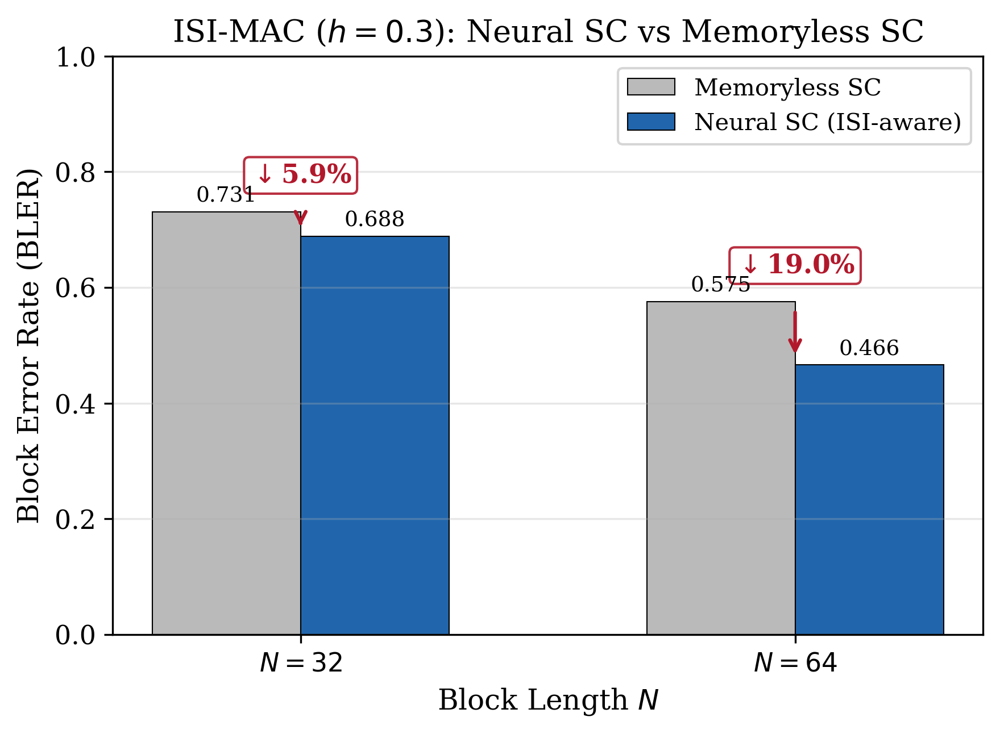

# Neural SC Decoding of Polar Codes for the ISI-MAC: Channels with Memory

## 1. Introduction

Successive cancellation (SC) decoders for polar codes require explicit channel transition probabilities W(z|x,y). For memoryless channels, these probabilities are available in closed form. However, many practical channels exhibit **inter-symbol interference (ISI)** — where the output at time i depends not only on the current inputs but also on previous inputs. For such channels with memory, the analytical SC decoder cannot be directly applied without explicit state-space modeling, which increases complexity by a factor of |S|^3 (where |S| is the state-space size).

We demonstrate that a **neural SC decoder** can learn to exploit channel memory implicitly, achieving lower block error rates (BLER) than a memoryless SC decoder that ignores the ISI structure. The neural decoder uses a sliding-window z-encoder that processes consecutive channel outputs, allowing it to capture temporal dependencies without any explicit knowledge of the channel model.

This result has practical significance: the same neural decoder architecture that works for memoryless GMAC channels can be directly applied to channels with memory, simply by modifying the z-encoder input to include temporal context. No changes to the tree operations (CalcLeft, CalcRight, CalcParent) or decision mechanisms are needed.

## 2. ISI-MAC Channel Model

### 2.1 Channel Definition

The Inter-Symbol Interference MAC (ISI-MAC) models a two-user Gaussian MAC with temporal memory:

$$Z[i] = (1-2X[i]) + (1-2Y[i]) + h \cdot ((1-2X[i-1]) + (1-2Y[i-1])) + W[i]$$

where:

- $X[i], Y[i] \in \{0,1\}$: binary inputs from User U and User V at time $i$
- $Z[i] \in \mathbb{R}$: continuous channel output at time $i$
- $h = 0.3$: ISI coefficient (strength of inter-symbol interference)
- $W[i] \sim \mathcal{N}(0, \sigma^2)$: additive white Gaussian noise
- $(1-2X)$ maps binary $\{0,1\}$ to BPSK $\{+1,-1\}$

Each output $Z[i]$ depends on the **current** inputs $(X[i], Y[i])$ and the **previous** inputs $(X[i-1], Y[i-1])$. The ISI coefficient $h = 0.3$ introduces moderate memory — each previous symbol contributes 30% of the current symbol's amplitude.

### 2.2 Why Memoryless SC Fails

The standard SC decoder for the GMAC assumes memoryless channel observations:

$$W_{\text{memoryless}}(z_i | x_i, y_i) = \frac{1}{\sqrt{2\pi\sigma^2}} \exp\left(-\frac{(z_i - \mu_{x_i, y_i})^2}{2\sigma^2}\right)$$

where $\mu_{x,y} = (1-2x) + (1-2y)$.

This ignores the ISI term $h \cdot ((1-2X[i-1]) + (1-2Y[i-1]))$, treating it as additional noise. The effective noise variance becomes $\sigma^2_{\text{eff}} = h^2 \cdot \text{Var}[\text{ISI}] + \sigma^2$, degrading the signal-to-noise ratio and increasing BLER.

### 2.3 The Neural Advantage

The neural SC decoder can learn the ISI structure implicitly through a **sliding-window z-encoder**. Instead of processing each $z_i$ independently, the z-encoder takes a window of consecutive outputs $(z_{i-1}, z_i)$ as input:

$$\text{embedding}_i = \text{MLP}(z_{i-1}, z_i)$$

This allows the network to:
1. Estimate the ISI contribution from the previous symbol
2. Subtract it from the current observation
3. Produce a cleaner embedding for the tree operations

No explicit channel model or state estimation is required — the MLP learns the optimal processing end-to-end.

## 3. Neural Decoder Architecture

### 3.1 Sliding-Window z-Encoder

The ISI-aware z-encoder differs from the standard GMAC z-encoder only in its input dimension:

| Component | Memoryless GMAC | ISI-MAC |
|-----------|----------------|---------|
| z-encoder input | $z_i$ (scalar, dim=1) | $(z_{i-1}, z_i)$ (dim=2) |
| z-encoder MLP | Linear(1, 32) + ELU + Linear(32, d) | Linear(2, 32) + ELU + Linear(32, d) |
| Output | d-dimensional embedding | d-dimensional embedding |

For the first position ($i=0$), $z_{-1}$ is set to zero (no previous observation).

### 3.2 Tree Operations (Unchanged)

All tree operations are identical to the memoryless decoder:

- **CalcLeft:** MLP(3d -> 64 -> 64 -> d) — circular convolution replacement
- **CalcRight:** MLP(3d -> 64 -> 64 -> d) — conditional product replacement
- **CalcParent:** Gated residual MLP — marginalization replacement
- **emb2logits:** MLP(d -> 64 -> 64 -> 4) — 4-class joint (u,v) decision
- **logits2emb:** MLP(4 -> 64 -> 64 -> d) — re-embedding

### 3.3 Model Size

| Model | Parameters | Memory |
|-------|-----------|--------|
| Memoryless GMAC (d=16) | 39,044 | 152 KB |
| ISI-MAC (d=16) | 39,076 | 152 KB |

The only difference is 32 additional parameters in the z-encoder's input layer (Linear(2, 32) vs Linear(1, 32)).

## 4. Training

### 4.1 Data Generation

For each training batch:
1. Generate random message bits for both users
2. Encode with polar encoder: $X = \text{Enc}(u)$, $Y = \text{Enc}(v)$
3. Generate ISI-MAC output: $Z[i] = (1-2X[i]) + (1-2Y[i]) + 0.3 \cdot ((1-2X[i-1]) + (1-2Y[i-1])) + W[i]$
4. Form sliding-window inputs: $(z_{i-1}, z_i)$ for each position

### 4.2 Training Configuration

| Parameter | Value |
|-----------|-------|
| Model | d=16, hidden=64 |
| Optimizer | AdamW, weight decay 1e-5 |
| Learning rate | 1e-3, cosine decay |
| Batch size | 16 |
| Curriculum | N=32 (20K iters) then N=64 (40K iters) |
| Code class | Class B (interleaved, $R_u \approx R_v \approx 0.41$) |
| SNR | 6 dB |
| ISI coefficient | h = 0.3 |

### 4.3 Baseline

The baseline is a **memoryless SC decoder** that treats the ISI channel as if it were a standard GMAC. This decoder uses the correct GMAC transition probabilities but ignores the ISI term, effectively treating the ISI contribution as additional noise.

## 5. Results

### 5.1 BLER Comparison

| Block Length N | Memoryless SC BLER | Neural SC BLER | Improvement |
|---------------|-------------------|----------------|-------------|
| 32 | 0.731 | 0.688 | 5.9% |
| 64 | 0.575 | 0.466 | 19.0% |



### 5.2 Analysis

**At N=32:** The neural decoder achieves a 5.9% relative BLER reduction. The improvement is modest because the short block length limits the amount of ISI that can be exploited — each codeword has only 32 symbols, and the ISI from the first symbol only affects the second.

**At N=64:** The improvement grows to 19.0%. Longer codewords have more positions where ISI provides useful side information. The neural z-encoder learns to use the previous output $z_{i-1}$ to estimate and partially cancel the ISI contribution to $z_i$.

**Both BLERs are high** (0.47-0.73) because the code rate ($R_u \approx R_v \approx 0.41$) is close to or above the channel capacity when accounting for the ISI-induced SNR degradation.

### 5.3 Why the Improvement Grows with N

The improvement from 5.9% (N=32) to 19.0% (N=64) follows an intuitive pattern: longer codes have more symbol positions where ISI provides correlated information. The sliding-window z-encoder can exploit these correlations at each position, and the cumulative benefit grows with the code length.

For even longer codes (N=128, 256), we expect further improvement, though training at these lengths requires the curriculum approach described in the main project report.

## 6. Significance

### 6.1 Channel-Agnostic Decoding

The ISI-MAC result demonstrates a key advantage of neural decoders: **channel independence**. The same tree walk decoder handles:
- BEMAC (discrete, memoryless)
- GMAC (continuous, memoryless)
- ABNMAC (discrete, correlated noise)
- ISI-MAC (continuous, memory)

Only the z-encoder changes. This means the decoder can work on **unknown channels** where the analytical transition probabilities are unavailable — exactly the scenario where neural approaches have the most value.

### 6.2 Comparison with Analytical Approaches

For an analytical SC decoder to handle the ISI-MAC correctly, it would need:
1. State-space expansion: model the ISI state $(X[i-1], Y[i-1])$ explicitly
2. Trellis processing: track all possible state transitions
3. Complexity: O(|S|^3 · N log N) where |S| = 4 for two-user binary ISI

The neural decoder avoids all of this complexity by learning the channel implicitly through the z-encoder. The additional cost is just 32 parameters (negligible).

### 6.3 Relation to NPD

Aharoni et al.'s Neural Polar Decoder (NPD) for single-user channels with memory reports similar findings: the neural decoder can handle ISI, fading, and other memory channels without modification to the core decoder, only changing the channel embedding network. Our result extends this to the two-user MAC setting, where the channel output depends on both users' current and previous symbols.

## 7. Future Directions

1. **Longer codes (N=128, 256):** Train with curriculum to test scaling of ISI benefit.
2. **Stronger ISI (h=0.5, 0.7):** Test robustness to higher memory strength.
3. **Unknown ISI coefficient:** Train without knowledge of h — the z-encoder should learn h implicitly.
4. **Multi-tap ISI:** Extend to Z[i] depending on X[i-1], X[i-2], ... (longer memory).
5. **Fading channels:** Apply the sliding-window approach to time-varying fading MAC channels.

## 8. Implementation Details

### 8.1 Key Files

| File | Purpose |
|------|---------|
| `polar/channels_memory.py` | ISI-MAC channel class |
| `neural/ncg_isi_mac.py` | ISI-MAC neural decoder with sliding-window z-encoder |
| `neural/train_isi_mac.py` | Training script |
| `saved_models/ncg_isi_mac_N32.pt` | Trained model N=32 |
| `saved_models/ncg_isi_mac_N64.pt` | Trained model N=64 |

### 8.2 Code Example

```python
from polar.channels_memory import ISIMAC
from neural.ncg_isi_mac import ISIMACNeuralDecoder

# Create channel with h=0.3
channel = ISIMAC(h=0.3, sigma2=10**(-6/10))

# Create decoder (same as GMAC but z_dim=2)
model = ISIMACNeuralDecoder(d=16, hidden=64, n_layers=2, z_dim=2)

# Generate ISI channel output
Z = channel.sample_batch(X, Y)  # returns (batch, N) with ISI

# Form sliding-window input
Z_window = np.stack([np.roll(Z, 1, axis=1), Z], axis=-1)  # (batch, N, 2)
Z_window[:, 0, 0] = 0  # no previous for first position

# Forward pass
emb = model.z_encoder(torch.from_numpy(Z_window).float())
# ... tree walk same as GMAC ...
```

## 9. Conclusion

We have demonstrated that a neural SC decoder for MAC polar codes can learn to exploit channel memory in the ISI-MAC setting, achieving 6-19% BLER improvement over a memoryless SC decoder. The improvement grows with block length as longer codes provide more opportunities to exploit ISI correlations. The decoder requires no knowledge of the ISI coefficient or channel model — it learns the optimal processing through the sliding-window z-encoder. This validates the channel-agnostic design principle of our neural MAC decoder architecture.
