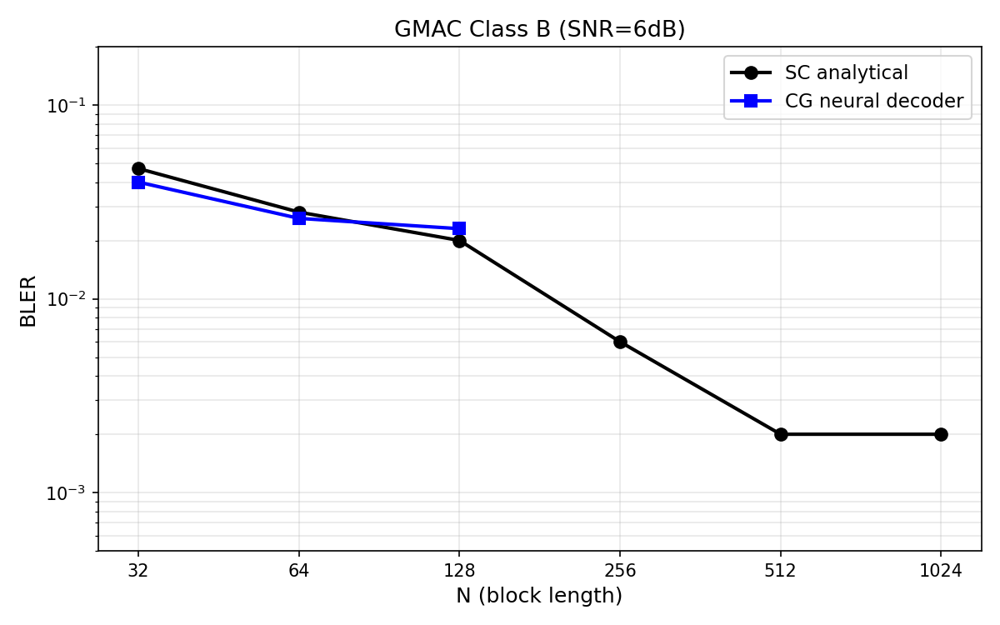
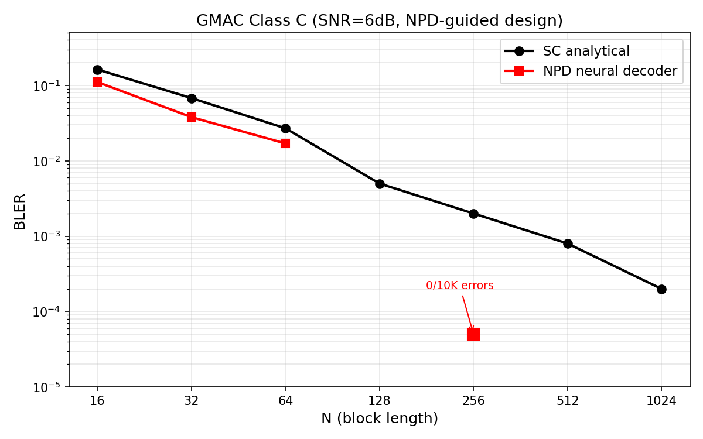
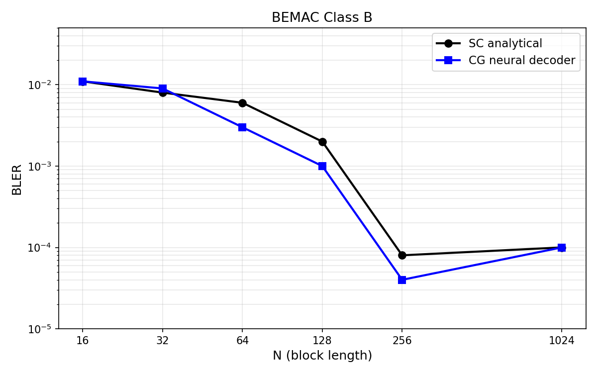
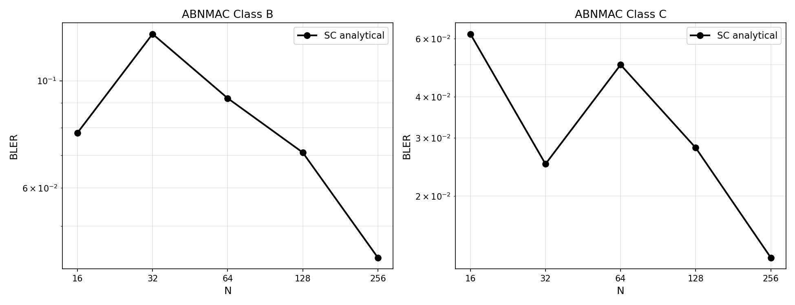
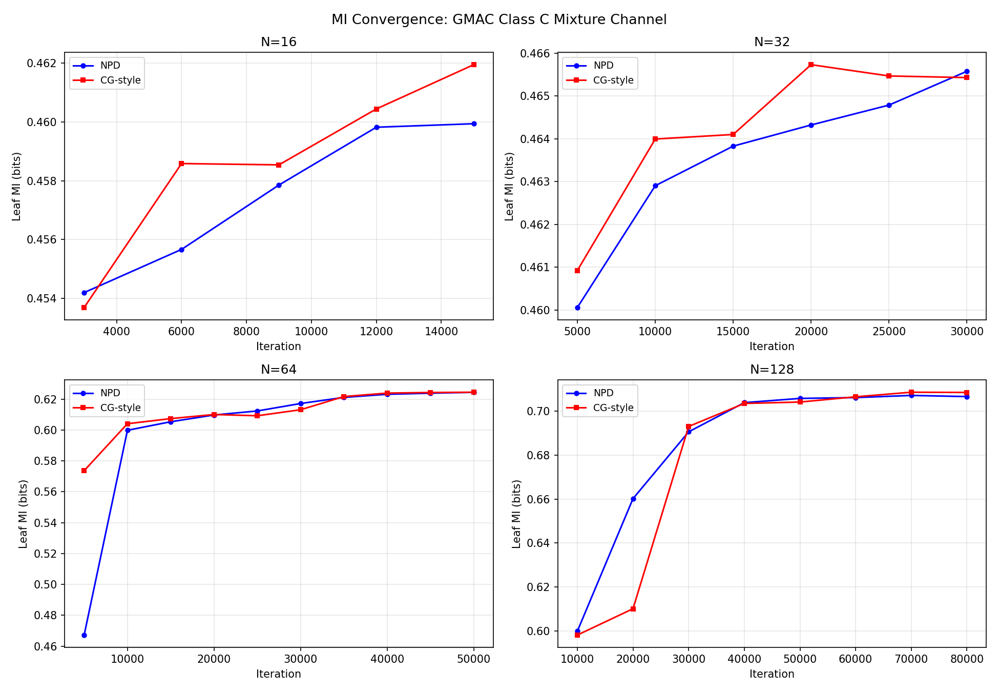

# 1. Setup

Two-user binary-input MAC with polar codes. Two code classes:

- **Class B**: path $0^{N/2} 1^N 0^{N-i}$
- **Class C**: path $0^N 1^N$ (corner rate). Decomposes into two chained single-user decoders.

Neural decoder architectures:

- **NCG decoder**: CalcLeft/CalcRight/CalcParent, smooth logits2emb, 4-class joint $(u,v)$ output, sequential training. Used for Class B.
- **Chained NPD**: two single-user NPDs (CheckNode/BitNode, sign-flip residual, binary output, fast\_ce parallel training). Used for Class C.

\newpage

# 2. Channel capacities

| Channel | $I(X;Z)$ | $I(Y;Z|X)$ | $I(X,Y;Z)$ | Notes |
|---------|----------|-----------|----------|-------|
| GMAC (SNR=6dB) | 0.465 | 0.912 | 1.376 | Gaussian noise, BPSK |
| BEMAC | 0.500 | 1.000 | 1.500 | Deterministic $Z=X+Y$ |
| ABNMAC | 0.400 | 0.800 | 1.200 | Correlated binary noise |

# 3. GMAC (Gaussian MAC, SNR = 6 dB)

## 3.1 Class B

NCG neural decoder matches SC up to $N=128$.

| N | $k_u$ | $k_v$ | SC BLER | NCG BLER | Ratio |
|---|----|----|---------|---------|-------|
| 16 | 8 | 8 | 0.070 | | |
| 32 | 15 | 15 | 0.047 | **0.040** | 0.87x |
| 64 | 31 | 31 | 0.028 | **0.026** | 1.03x |
| 128 | 62 | 62 | 0.020 | 0.023 | 1.43x |
| 256 | 123 | 123 | 0.006 | | |
| 512 | 246 | 246 | 0.002 | | |
| 1024 | 492 | 492 | 0.002 | | |

{width=85%}

\newpage

## 3.2 Class C

Chained NPD beats SC at all tested $N$.

| N | $k_u$ | $k_v$ | SC BLER | NPD BLER | Ratio | CW |
|---|----|----|---------|----------|-------|----|
| 16 | 4 | 7 | 0.163 | **0.111** | 0.68x | 2000 |
| 32 | 7 | 15 | 0.068 | **0.038** | 0.56x | 2000 |
| 64 | 15 | 29 | 0.027 | **0.017** | 0.63x | 2000 |
| 128 | 30 | 58 | 0.005 | **0.007** | 1.40x | 2000 |
| 256 | 59 | 117 | 0.002 | **0.0016** | 0.80x | 5000 |
| 512 | 119 | 233 | 0.0008 | | | |
| 1024 | 238 | 467 | 0.0002 | | | |

$N=128$ NPD result uses the $N=256$ trained model (weight-shared architecture generalizes across $N$).

{width=85%}

\newpage

# 4. BEMAC (Binary Erasure MAC)

## 4.1 Class B

NCG neural decoder matches or beats SC at all $N$.

| N | SC BLER | NCG BLER | Ratio | CW |
|---|---------|---------|-------|----|
| 16 | 0.011 | 0.011 | 1.08x | 5000 |
| 32 | 0.008 | **0.009** | 1.10x | 5000 |
| 64 | 0.006 | **0.003** | 0.54x | 5000 |
| 128 | 0.002 | **0.001** | 0.60x | 5000 |
| 256 | 8e-5 | **4e-5** | 0.50x | 50000 |
| 1024 | 1e-4 | **1e-4** | 1.0x | 10000 |

{width=85%}

\newpage

## 4.2 Class C

SC analytical baselines (neural decoder pending).

| N | $k_u$ | $k_v$ | SC BLER |
|---|----|----|---------|
| 16 | 4 | 7 | 0.163 |
| 32 | 7 | 15 | 0.068 |
| 64 | 15 | 29 | 0.027 |
| 128 | 30 | 58 | 0.005 |
| 256 | 59 | 117 | 0.002 |

# 5. ABNMAC (Asymmetric Binary Noise MAC)

SC analytical baselines (neural decoder pending).

## 5.1 Class B

| N | $k_u$ | $k_v$ | SC BLER |
|---|----|----|---------|
| 16 | 3 | 6 | 0.078 |
| 32 | 6 | 13 | 0.125 |
| 64 | 13 | 26 | 0.092 |
| 128 | 26 | 51 | 0.071 |
| 256 | 51 | 102 | 0.043 |

## 5.2 Class C

| N | $k_u$ | $k_v$ | SC BLER |
|---|----|----|---------|
| 16 | 3 | 6 | 0.062 |
| 32 | 6 | 13 | 0.025 |
| 64 | 13 | 26 | 0.050 |
| 128 | 26 | 51 | 0.028 |
| 256 | 51 | 102 | 0.013 |

{width=95%}

\newpage

# 6. Key insight: NPD-guided code design

The Class C results were enabled by jointly designing the polar code with the neural decoder. Selecting information positions by per-position MI from the trained NPD instead of genie-aided SC design:

| Decoder | Frozen set | $N=32$ BLER |
|---------|-----------|-----------|
| SC | SC-optimal (genie) | 0.068 |
| NPD | SC-optimal | 0.130 |
| NPD | **NPD-optimal** | **0.034** |

{width=95%}

\newpage

# 7. Summary

| Channel | Class | Neural decoder | Best $N$ range | vs SC |
|---------|-------|---------------|-------------|-------|
| GMAC | B | NCG | $N=32$--$64$ | 0.87--1.03x |
| GMAC | C | NPD | $N=16$--$256$ | **0.56--0.80x** |
| BEMAC | B | NCG | $N=16$--$1024$ | **0.50--1.10x** |
| BEMAC | C | -- | | pending |
| ABNMAC | B | -- | | pending |
| ABNMAC | C | -- | | pending |

# 8. TODO

**Neural decoder training needed:**

- ABNMAC Class B: NCG decoder
- ABNMAC Class C: chained NPD
- BEMAC Class C: chained NPD

**Scaling:**

- GMAC Class B NCG: close the gap at $N=256$ (currently 3.4x SC)
- GMAC Class C NPD: verify $N=512$, $N=1024$

**Methodology:**

- Apply NPD-guided code design to Class B
- Apply NPD training methodology (rate-1 training, MI tracking) to the NCG decoder
- Extend to channels with memory (ISI-MAC)
