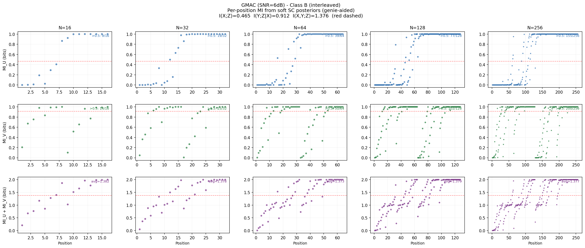
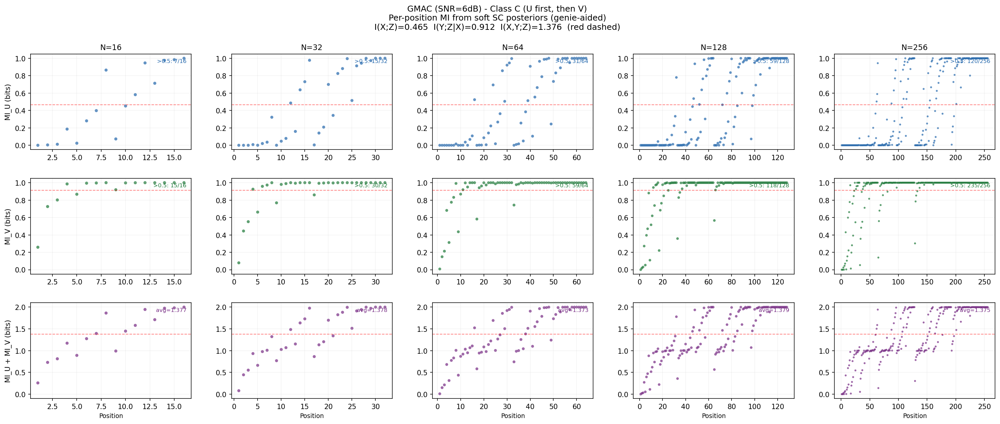
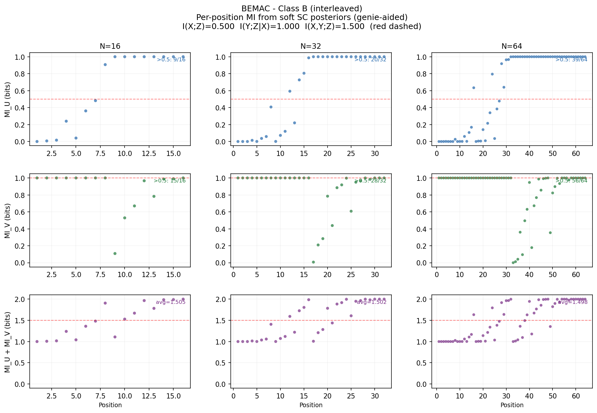
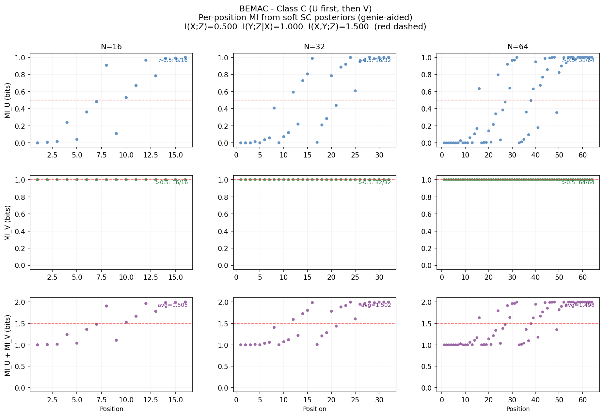
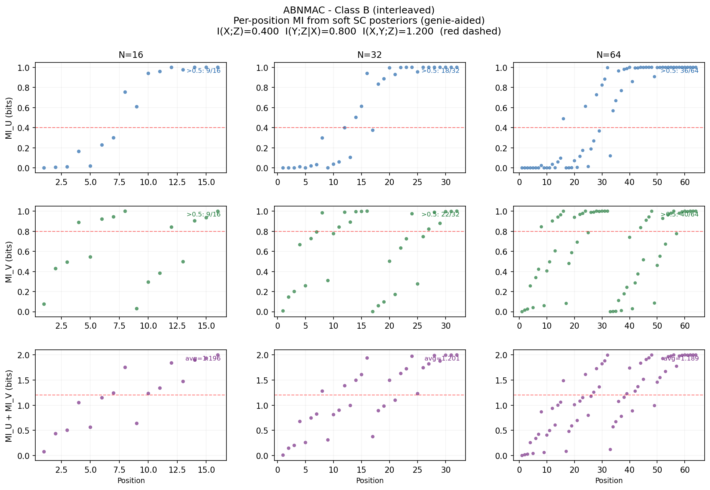
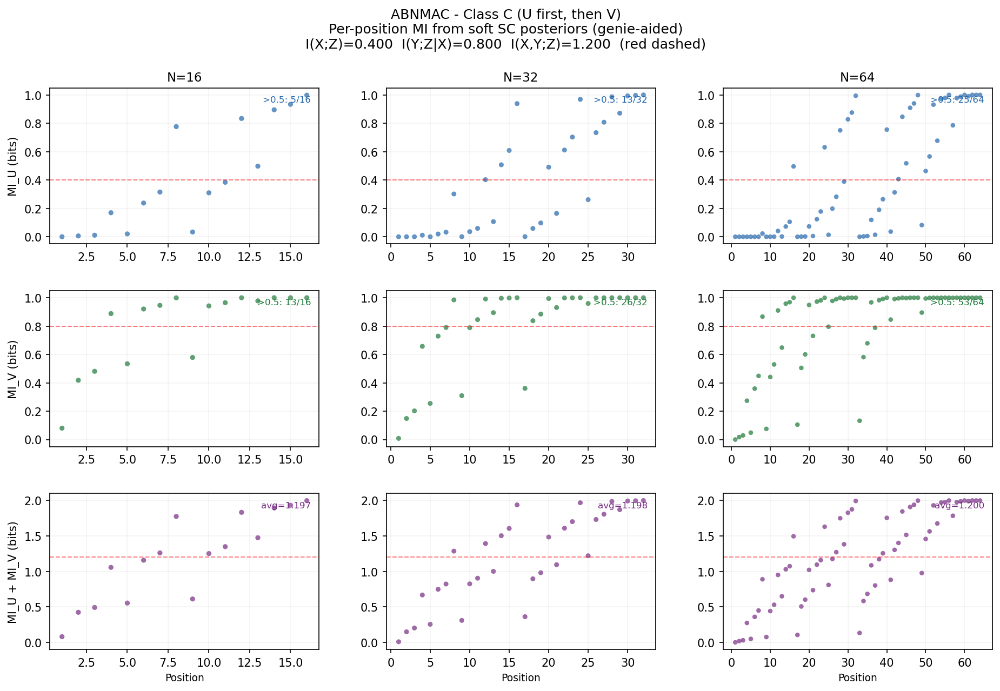
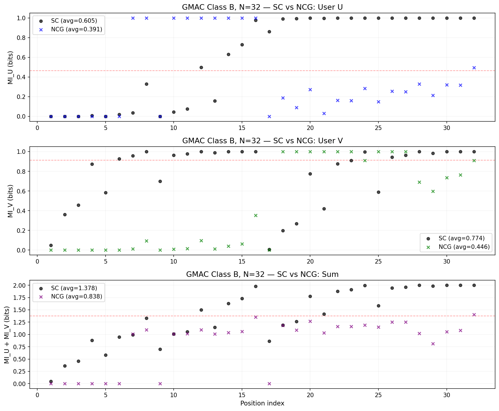
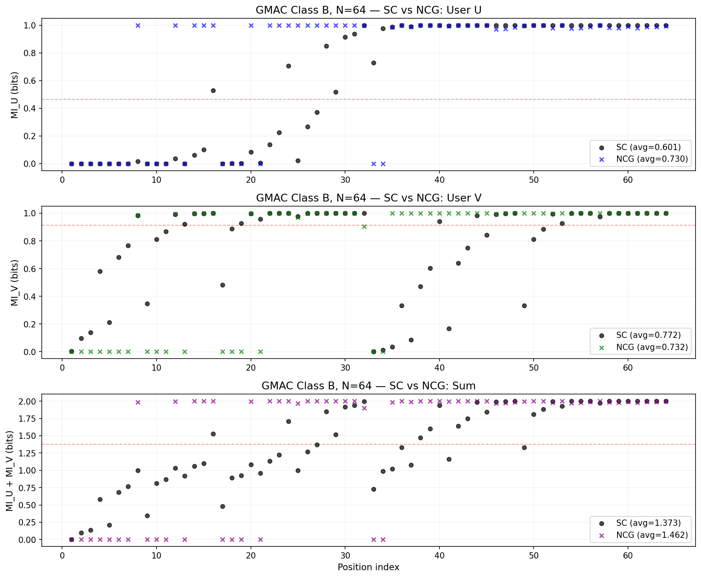

# Method

At each position $i$, the genie-aided SC decoder produces a posterior probability $p_i = P(U_i = 0 \mid Z^N, U_1^{i-1})$ (for user U) or $P(V_i = 0 \mid Z^N, V_1^{i-1})$ (for user V). The per-position MI is:

$$\text{MI}_i = 1 - H(p_i) = 1 - \mathbb{E}[-p_i \log_2 p_i - (1-p_i) \log_2(1-p_i)]$$

This is the true mutual information of the $i$-th synthetic channel. It satisfies:

- $\text{MI}_i \in [0, 1]$: ranges from 0 (no information) to 1 (perfect prediction)
- **Conservation:** $\frac{1}{N}\sum_i \text{MI}^{(U)}_i = I(X;Z)$ and $\frac{1}{N}\sum_i \text{MI}^{(V)}_i = I(Y;Z|X)$
- **Polarization:** as $N \to \infty$, each MI$_i \to 0$ or $1$

The red dashed line marks the channel capacity. The average MI across all positions equals the capacity.

\newpage

# GMAC (SNR = 6 dB): Class B

$I(X;Z) = 0.465$, $I(Y;Z|X) = 0.912$, $I(X,Y;Z) = 1.376$

{width=100%}

\newpage

# GMAC (SNR = 6 dB): Class C

{width=100%}

\newpage

# BEMAC: Class B

$I(X;Z) = 0.500$, $I(Y;Z|X) = 1.000$, $I(X,Y;Z) = 1.500$

{width=100%}

\newpage

# BEMAC: Class C

{width=100%}

\newpage

# ABNMAC: Class B

$I(X;Z) = 0.400$, $I(Y;Z|X) = 0.800$, $I(X,Y;Z) = 1.200$

{width=100%}

\newpage

# ABNMAC: Class C

{width=100%}

\newpage

# SC vs NCG Decoder: GMAC Class B

The NCG (Neural Computational Graph) decoder uses learned CalcLeft/CalcRight/CalcParent operations with teacher-forced sequential training. Black dots = SC analytical, colored crosses = NCG neural.

## N=32

{width=100%}

\newpage

## N=64

{width=100%}
